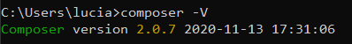
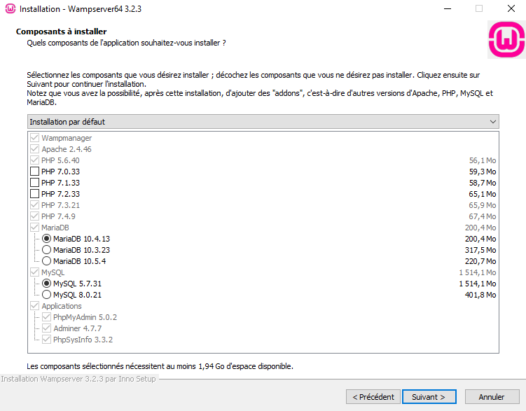
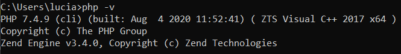
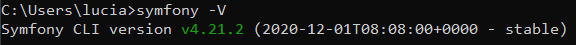
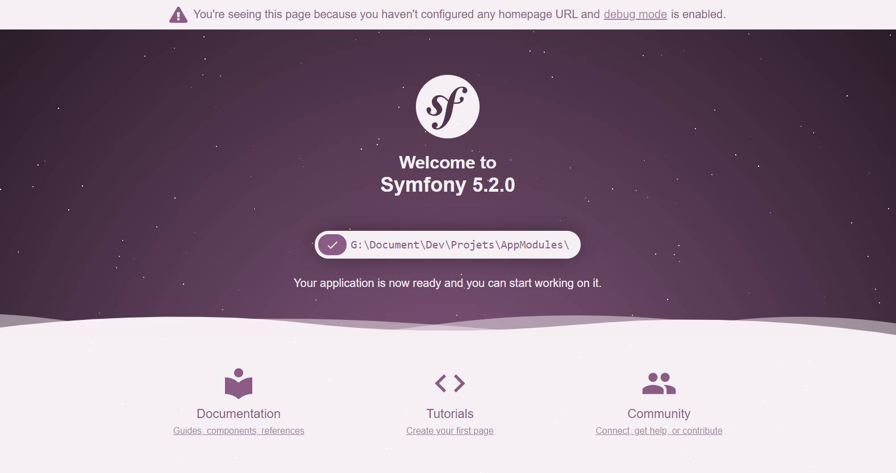

# AppModules

## Objectif
Cette application web a pour but de faciliter l'organisation au sein de modules universitaire.

## Documentation
La documentation est disponible [ici](docs/index.md).

## Mise en oeuvre

### Pré-requis

#### Composer
Composer doit être installé à cette [adresse](https://getcomposer.org/download/) 
et doit être ajouté au **PATH**.

Pour vérifier son installation :



#### Wampserver
Wampserver va nous permettre d'avoir un serveur Apache ainsi que phpMyAdmin pour gérer
les tables. A noter que wampServer va également se charger d'installer PHP en version 7.4.9 
et mySQL en version 5.7.31. Il est disponible à cette [adresse](https://www.wampserver.com/#download-wrapper).



Pour vérifier l'installation de php :



#### Symfony CLI
Symfony CLI doit être installé à cette [adresse](https://symfony.com/download) 
et doit être ajouté au **PATH**.

Pour vérifier son installation :



### Initialisation du projet

- Cloner le projet git

```
git clone https://github.com/luciaLebrun/AppModules.git
```

- Mettre à jour composer

``
composer install
``

- Créer le .env.local et ajouter la ligne

``
DATABASE_URL="mysql://root:@127.0.0.1:3306/appModules?serverVersion=5.7"
``

- Lancer Wampserver

- Créer la database, les tables et les fixtures

``
composer database
``

Le script va exécuter les commandes suivantes:

```
php bin/console doctrine:database:drop --if-exists -f
php bin/console doctrine:database:create
php bin/console doctrine:schema:update --force
```

- Si vous souhaitez ajouter des données de test à la base de données :

``
php bin/console doctrine:fixtures:load -n
``

- Lancer le site

``
symfony serve
`` 


