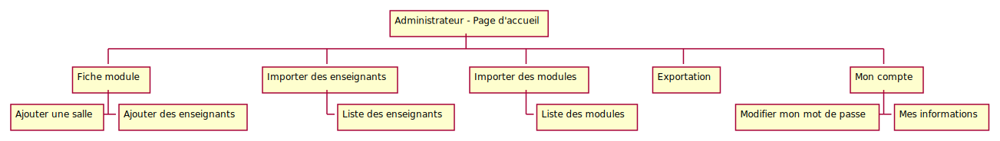
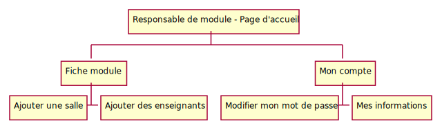
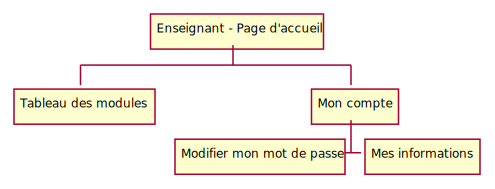
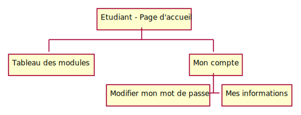
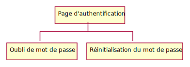

# Analyse

[Retour au sommaire](index.md)

* [Types de sociétés](#types-de-société)
* [Rôles](#rôles)
* [Combinaison Type de société/Rôle](#combinaison-type-de-société/rôle)
* [Administrateur](#administrateur)

## Types de société

* Administrateur
* Responsable de module
* Consulteur

## Rôles

* DDE
* Responsable de module
* Enseignant
* Intervenant
* Etudiant (optionnel)

## Combinaison Types de société/Rôle

* Administrateur
    * DDE
    
* Responsable de module
    * Responsable de module
  
* Consulteur
    * Enseignant
    * Intervenant
    * Etudiant (optionnel)
  
## Administrateur

## Responsable de module 

## Enseignant - Consulteur

## Intervenant - Consulteur

## Etudiant - Consulteur (optionnel)

## Visiteur

