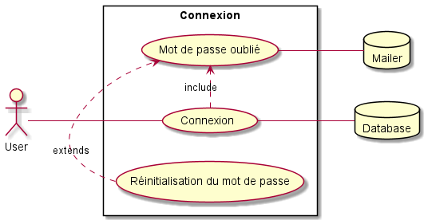

# UML

[Retour au sommaire](index.md)

* [Cas d'utilisation](#cas-dutilisation)
    * [Connexion](#connexion)
    * [Gestion des modules](#gestion-des-modules)
    * [Gestion des enseignants](#gestion-des-enseignants)
    * [Gestion des fiches module](#gestion-des-fiches-module)
    * [Mon compte](#mon-compte)
    
## Cas d'utilisation

### Connexion

[](uml/v2/use_cases/login.puml)

#### Premier retour
```
Prévoir un mot de passe initial sans caractères spéciaux et d’une longueur max de 10
caractères. L'accès ne doit pas avoir une protection maximal.
```
### Gestion des modules

#### Premier retour
```
```

### Gestion des enseignants

#### Premier retour
```
```

### Gestion des fiches module

#### Premier retour
```
```

### Mon compte

#### Premier retour
```
```