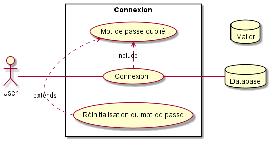
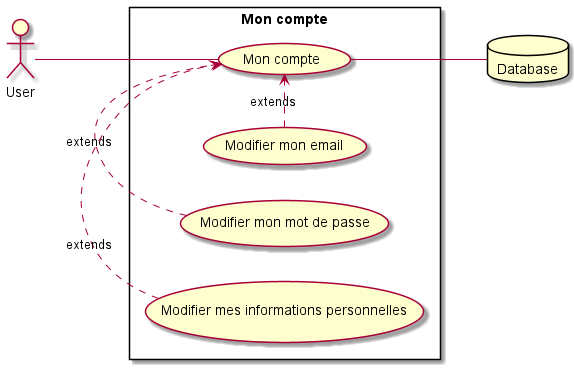

# UML

[Retour au sommaire](index.md)

* [Cas d'utilisation](#cas-dutilisation)
    * [Connexion](#connexion)
    * [Gestion des modules](#gestion-des-modules)
    * [Gestion des enseignants](#gestion-des-enseignants)
    * [Gestion des fiches module](#gestion-des-fiches-module)
    * [Mon compte](#mon-compte-(provisoire))
    
## Cas d'utilisation

### Connexion

[](uml/v2/use_cases/login.puml)

#### Notes
```
Prévoir un mot de passe initial sans caractères spéciaux et d’une longueur max de 10
caractères. L'accès ne doit pas avoir une protection maximal.
```
### Gestion des modules

[](uml/v2/use_cases/modules.puml)

#### Notes
```
Le DDE doit pouvoir importer un fichier .csv.
Certaines normes doivent être respectées (voir le wiki)
On doit comparer au préalable les données présentes dans le CSV et dans la base de données pour éviter les conflits entre les tables
```

### Gestion des enseignants

[](uml/v2/use_cases/enseignants.puml)

#### Notes
```
Le DDE doit pouvoir importer un fichier .csv.
Certaines normes doivent être respectées (voir le wiki)
On doit comparer au préalable les données présentes dans le CSV et dans la base de données pour éviter les conflits entre les tables
```

### Gestion des fiches module

#### Notes
```
```

### Mon compte (provisoire)

[](uml/v2/use_cases/compte.puml)

#### Notes
```
```